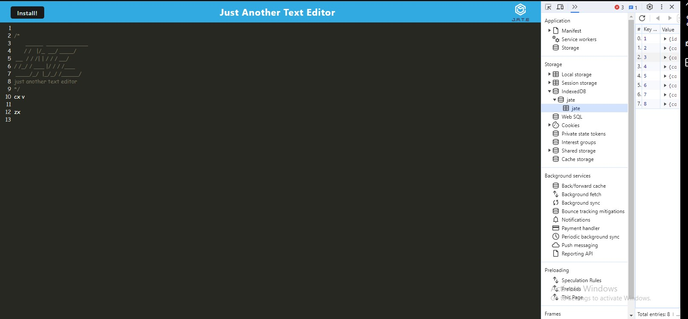

# Nelson's WEBtextEditor

## Descryption

A browser based texted editor that uses indexedDB database. We use a IDB package which helps us store structured data in web browsers.

## Table of Contents

1. [Installation](#installation)
2. [Usage](#usage)
3. [Credits](#credits)
4. [License](#license)
5. [Features](#features)
6. [How to Contribute](#contribute)
7. [Test](#test)
8. [Questions](#questions)

## Installation

Clone it from my repo on github.

## Usage

You will need to do a npm install to install all the packages and npm run start to run it to your localstorage.

## Credits

Javascript,
Node.js,
idb: ^6.1.2,
express: ^4.17.1,
concurrently: ^5.2.0,
nodemon: ^2.0.4,
code-mirror-themes: ^1.0.0,
@babel/core: ^7.15.0,
@babel/plugin-proposal-object-rest-spread: ^7.20.7,
@babel/plugin-transform-runtime: ^7.15.0,
@babel/preset-env: ^7.15.0,
@babel/runtime: ^7.15.3,
babel-loader: ^8.2.2,
css-loader: ^6.2.0,
html-webpack-plugin: ^5.3.2,
http-server: ^0.11.1,
style-loader: ^3.2.1,
webpack: ^5.51.1,
webpack-cli: ^4.8.0,
webpack-dev-server: ^4.0.0,
webpack-pwa-manifest: ^4.3.0,
workbox-webpack-plugin: ^6.2.4.

## License

N/A

## Features

The application works without internet. It also saves content in the text editor automatically when the dom is not focused.
Its bundled with webpack. Uses service workers with workbox that caches static assets. The web application can also be installed.

## How to Contribute

Contact me.

## Test

To test it you'll have to clone the repo, install the packages, and start the localstorage.

## Questions

Github: [MartinezN2014](https://github.com/MartinezN2014)

Email: [Email](2014nmartinez@gmail.com)

